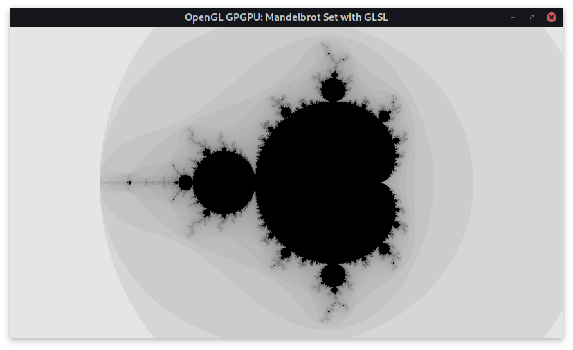

# OpenGL GPGPU: GLSL Mandelbrot Shader

Simple application showing how to use the GLSL fragment shader to compute and draw the Mandelbrot set directly on the GPU.
This is not a sophisticated method and only well suited for learning purposes.



## Requirements
- C++ Standard: C++14
- C++ Compiler: GCC | Clang | [Nuwen MinGW](https://nuwen.net/mingw.html) | MinGW | MSVC
- Operating System: Linux | Windows
- External Libraries:
    + [glbinding](https://glbinding.org/)
    + [GLFW](https://www.glfw.org/)
    + [GLM](https://glm.g-truc.net/0.9.9/index.html)

## Build and Run with build2

This code explicitly uses only the build system of the build2 compiler toolchain to elaborate on alternative build techniques.

### Linux
Make sure all dependencies are installed.
Open a terminal in the project root and run the following command to build and run the code.

    b test

For a custom configuration, you can run something like the following.

    b test \
        config.cxx=clang++ \
        "config.cxx.coptions=-O3 -march=native"

### Windows
#### Nuwen MinGW Compiler Distribution
On Windows, I recommend to use the [Nuwen MinGW compiler distribution](https://nuwen.net/mingw.html) because in this distribution of MinGW all needed dependencies are already installed.
Use a custom configuration to be able to find the static libraries.
For now, make sure to change the line `import libs += glm%lib{glm}` in the `buildfile` to `#import libs += glm%lib{glm}`.
We are currently not able to find the GLM library automatically.
We want to use the static version of the GLFW library.
Hence, we have to additionally link the library `gdi32` into the application.

    b test \
        config.cxx=g++ \
        "config.cxx.poptions=-IC:/MinGW/include" \
        "config.cxx.loptions=-LC:/MinGW/lib" \
        "config.cxx.libs=-lgdi32"

#### Microsoft C++ Compiler or MinGW
Using the Microsoft C++ compiler or the standard MinGW compiler distribution, we will probably use dynamic libraries.
So make sure to install all dependencies to appropriate locations.
Again, uncomment the importation of the GLM library in the `buildfile`.
Of course, we have to customize this configuration as well.
This time, we will use the persistent configuration capabilities of build2.
Please note, this would also have been possible in the previous configurations.

    b configure

Open the file `build/config.build` and update the following entries.

    config.cxx = cl
    config.cxx.poptions = /IC:/GLFW/include /IC:/glbinding/include /IC:/glm/include
    config.cxx.loptions = /LIBPATH:C:/GLFW/lib /LIBPATH:C:/glbinding/lib

Now, run the following command to build and run the code.

    b test

## Usage

- Escape: Quit the program.
- Left Mouse Button: Move origin.
- Scroll Mouse Wheel: Zoom in or out.

## Background

Today, general-purpose computing on graphics processing units (GPGPU) is mostly done by using sophisticated tools such as CUDA, OpenCL, OpenMP, OpenACC, SYCL, and so on.
An application based on modern OpenGL can make use of custom shader programs to efficiently generate graphical output by performing computations on the GPU.
We are able to exploit those shader programs to solve a problem on the many-core graphics card without the use of the tools named above.
This method is to be understood as a hack and learning purpose and should not be used in production code.
In this example, we are computing a view of the well-known Mandelbrot set by using a simple vertex shader and an adequate fragment shader.

The vertex shader makes sure that we get the interpolated coordinates of every fragment or pixel in world space.

```c++
// Vertex Shader
#version 330

layout (location = 0) in vec2 vPos;
uniform mat4 MVP;
out vec2 pos;

void main(){
  gl_Position = MVP * vec4(vPos.x, vPos.y, 0.0, 1.0);
  pos = vPos;
}
```

To understand the fragment shader, you have to reflect on the typical algorithm used to render the Mandelbrot set.
We are starting in the complex plane with a coefficient value equal to the pixel coordinate in world space.


```c++
// Fragment Shader
#version 330

// Get the interpolated coordinate for the 
// current fragment from vertex shader.
in vec2 pos;

void main(){
  vec2 c = pos;
  vec2 z = vec2(0.0, 0.0);

  // Compute divergence order of given complex point.
  int it = 0;
  int max_it = 1000;
  for (; (dot(z, z) < 4.0) && (it < max_it); ++it){
    // Compute squared value of complex value 'z'
    // and add coefficient value.
    vec2 tmp = vec2(z.x * z.x - z.y * z.y, 2.0 * z.x * z.y);
    z = tmp + c;
  }

  // Transform the divergence order into some 
  // nice looking grayscale color.
  float scale = -log(float(it + 1) / max_it) / log(float(max_it));
  gl_FragColor = vec4(scale, scale, scale, 1.0);
}
```

## Authors
- lyrahgames: Markus Pawellek (markus.pawellek@mailbox.org)
